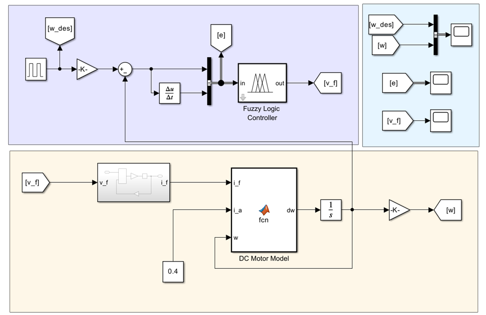
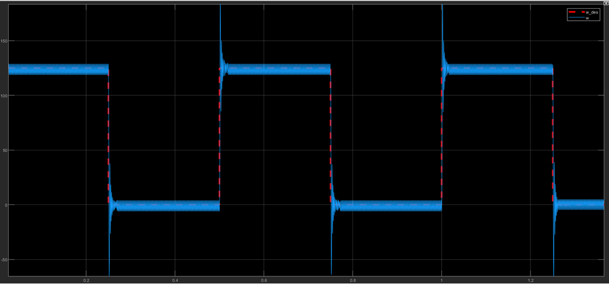

## Consider a motor control task where the objective is to maintain a constant motor speed. The inputs to the fuzzy logic controller are the error between the desired speed and the actual speed of the motor, and the derivative of the error. The output of the controller is the control signal (current) applied to the motor.

Fuzzy Logic Controller Design
Inputs:
• Error: Negative Big (NB), Negative Small (NS), Zero (Z), Positive Small
(PS), Positive Big (PB)
• Error Change: Negative (N), Positive Big (P)
Outputs:
• Control Signal: Negative Big (NB), Negative Small (NS), Zero (Z), Positive Small (PS), Positive Big (PB)

  
   
  
   

